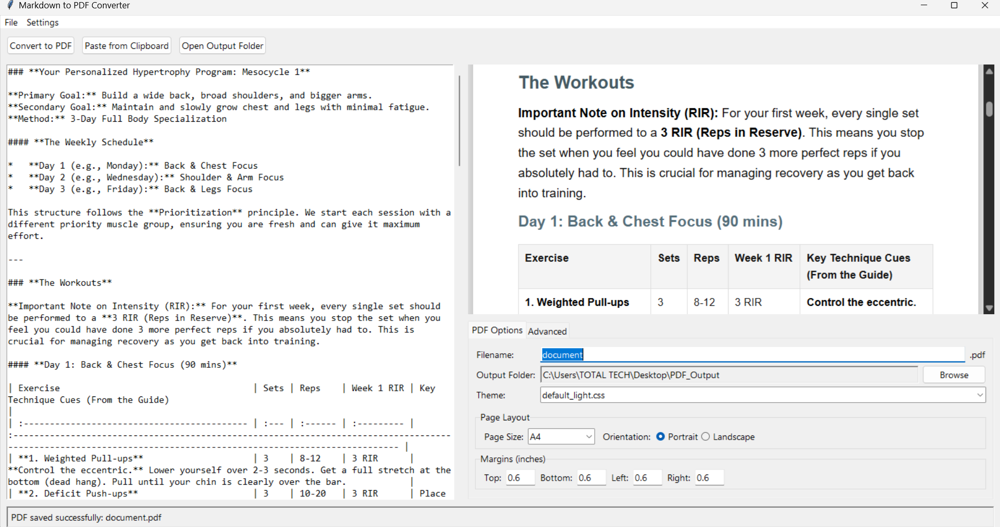

# Markdown to PDF Converter

A user-friendly desktop application for converting Markdown files to high-quality PDF documents, with a live preview and extensive customization options.



## Features

- **Live Preview**: See your rendered Markdown update in real-time as you type.
- **Customizable PDF Options**: Control page size, orientation, and margins.
- **Header & Footer**: Add custom text to headers and footers with page numbering.
- **Emoji Support**: Automatically converts standard emoji glyphs to high-quality FluentUI emoji images.
- **Themeable**: Comes with light and dark themes. Add your own CSS themes easily.
- **Markdown Extensions**: Toggle various Python-Markdown extensions like tables, footnotes, and admonitions.
- **Drag & Drop**: Drop Markdown files directly onto the editor.

## Prerequisites

This application requires an external dependency that must be installed and available on your system's PATH.

### wkhtmltopdf

This tool is used for the core PDF generation.
1.  **Download**: Go to the [wkhtmltopdf downloads page](https://wkhtmltopdf.org/downloads.html).
2.  **Install**: Install the package for your operating system. **Important:** During installation on Windows, make sure to check the box that says "Add to PATH".

## Installation

1.  **Clone the repository:**
    ```sh
    git clone https://github.com/your-username/your-repo-name.git
    cd your-repo-name
    ```

2.  **Install Python dependencies:**
    It's recommended to use a virtual environment.
    ```sh
    python -m venv venv
    source venv/bin/activate  # On Windows, use `venv\Scripts\activate`
    ```
    Then, install the required packages:
    ```sh
    pip install -r requirements.txt
    ```

## Usage

Run the application with the following command:

```sh
python markdown_converter_app.py
```

- Write or paste Markdown text into the left-hand editor pane.
- Use the options in the right-hand pane to configure the PDF output.
- Click "Convert to PDF" to generate and save your document.

## Project Structure

The application relies on assets for emoji rendering. They are located in the `assets/` directory.

- `assets/emoji_mapping.json`: Maps emoji characters to their corresponding asset folders.
- `assets/fluentui_assets/`: Contains the SVG emoji assets from the [FluentUI Emoji](https://github.com/microsoft/fluentui-emoji) project.

## License

This project is licensed under the MIT License. See the [LICENSE](LICENSE) file for details.